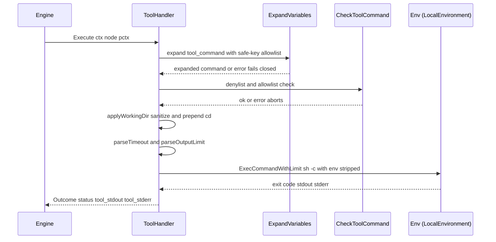

# Tool Handler (`tool`)

## Purpose

The tool handler runs a shell command in the run's working directory, captures
stdout/stderr, and maps the exit code to a pipeline outcome. It's how a
pipeline node executes something that's not an LLM agent — running tests,
invoking a formatter, generating a file, reading a directory, etc. Because
tool commands can embed LLM-generated content via variable expansion, the
handler applies multiple safety layers before dispatch.

Ground truth:
[`pipeline/handlers/tool.go`](../../../pipeline/handlers/tool.go).

## Node attributes

| Attribute | Type | Default | Behavior |
|-----------|------|---------|----------|
| `tool_command` | string (required) | — | Shell command to execute. `${ctx.foo}`, `${graph.bar}`, `${params.baz}` variable refs are expanded before execution. |
| `working_dir` | string | run dir | Prepends `cd "<dir>" && ` to the command. Rejected if it contains shell metacharacters or `..` path traversal. |
| `timeout` | duration | 30s | Per-command wall-clock limit (e.g. `30s`, `5m`). Non-positive or unparseable values error at execution time. |
| `output_limit` | bytes | 64KB | Per-stream (stdout or stderr) cap. Accepts raw bytes (`65536`), `KB`, or `MB` suffix. Capped at `max_output_limit` (default 10MB, configurable via `--max-output-limit`). |

Typed accessor: [`Node.ToolConfig`](../../../pipeline/node_config.go).

## Execute lifecycle



## Variable expansion and safe-key allowlist

[`expandAndValidateCommand`](../../../pipeline/handlers/tool.go) calls
`pipeline.ExpandVariables` with `toolCommandMode=true`. This mode enforces a
**safe-key allowlist** for `ctx.*` references:

- Allowed: `ctx.outcome`, `ctx.preferred_label`, `ctx.human_response`,
  `ctx.interview_answers` — all structurally author-controlled via gate
  edges or fixed handler outputs.
- Always allowed: `graph.*` and `params.*` — both are declared in the
  `.dip` file, so they're author-controlled by definition.
- Blocked: any other `ctx.*` key, including LLM-origin keys like
  `ctx.last_response`, `ctx.tool_stdout`, `ctx.response.*`.

The safe pattern for consuming LLM output in a tool command is to have a
prior tool node write the LLM response to a file on disk, then read from
that file in the tool command:

```dip
tool SaveResponse
  tool_command: 'printf "%s" "${ctx.last_response}" > .ai/output.json'  # blocked — fails closed

tool SaveResponseSafe
  tool_command: 'cat .ai/output.json | jq .field'  # LLM file already written by a previous agent
```

Expansion is **single-pass**: resolved values are not re-scanned. A value
containing literal `${...}` syntax is left alone, not recursively expanded.

If expansion fails or the expanded command is empty after trimming
whitespace, the handler fails closed with an error — it does not run `sh -c
""` or a command with literal `${...}` placeholders.

## Denylist and allowlist

[`CheckToolCommand`](../../../pipeline/handlers/tool_safety.go) runs after
expansion, before working-dir prepend:

- **Denylist** (built-in): patterns like `eval`, pipe-to-shell, `curl | sh`.
  Matches abort the command unless `--bypass-denylist` was passed at startup.
- **Allowlist** (optional): set via `--tool-allowlist` CLI flag or the
  `tool_commands_allow` graph attr. When non-empty, commands must match at
  least one allowlist pattern. The allowlist cannot override the denylist —
  a denylisted command is still blocked even if it matches an allowlist
  entry.

The check runs on the expanded user command, not the final `cd <dir> && <cmd>`
string, so allowlist patterns don't need to account for the injected `cd`
prefix.

## Working directory handling

[`applyWorkingDir`](../../../pipeline/handlers/tool.go) rejects unsafe values
before prepending `cd`:

- Any shell metacharacter in the set `` `$;|&()<>\n\r `` → error.
- `filepath.Clean`-normalized path that contains `..` → error.

The final command becomes `cd "<cleaned>" && <command>`. The double-quote
around `<cleaned>` protects path values with spaces.

## Timeout

[`parseTimeout`](../../../pipeline/handlers/tool.go):

- Missing attr → 30-second default (overridable at handler construction).
- Parseable positive duration → used as-is.
- **Zero or negative** → hard error at execute time with a message naming
  the node and the offending value. Previously these passed through to
  `context.WithTimeout`, which produced confusing "command timed out"
  failures immediately; this changed in v0.22.0 to surface misconfiguration
  instead of silently breaking.
- Unparseable string → error.

## Output limits

[`parseOutputLimit`](../../../pipeline/handlers/tool.go):

- Missing attr → handler's configured `outputLimit` (default 64KB).
- `parseByteSize` accepts raw digits, `KB` suffix, or `MB` suffix
  (case-insensitive).
- Capped at `maxOutputLimit` (default 10MB, configurable via
  `--max-output-limit`).

Limits apply per stream (stdout and stderr are capped independently). When a
stream exceeds the limit, `exec.LocalEnvironment.ExecCommandWithLimit` keeps
the **last** `limit` bytes (the tail) and discards the head. This matches
the routing convention where conditional edges read the trailing region of
the captured output for a marker like `printf 'tests-pass'`; pre-#208 the
runtime kept the head instead, which silently dropped trailing routing
markers under verbose output. The tool handler surfaces truncation via the
structured `EventToolOutputTruncated` event so `tracker diagnose` can
correlate routing misses with dropped bytes.

## Sensitive environment variable stripping

[`buildToolEnv`](../../../pipeline/handlers/tool.go) filters `os.Environ()`
against the patterns `*_API_KEY`, `*_SECRET`, `*_TOKEN`, `*_PASSWORD`
(case-insensitive `strings.Contains` match on the variable name). Matching
variables are removed from the subprocess environment. The override env var
`TRACKER_PASS_ENV=1` disables filtering entirely — set it explicitly when a
tool command needs an API key.

Stripping applies to `*exec.LocalEnvironment` only. Other
`exec.ExecutionEnvironment` implementations call `ExecCommand` without the
filtered env, because they have their own isolation model (sandbox, container).

## Outcomes produced

| Field | Value |
|-------|-------|
| `Status` | `OutcomeSuccess` on exit code 0, `OutcomeFail` on any non-zero exit. |
| `ContextUpdates.tool_stdout` | Right-trimmed *tail* of stdout, capped at `output_limit` bytes (default 64KB). Trailing whitespace / newlines are stripped so edge conditions match reliably; if the stream exceeded the cap, head bytes were elided (see `EventToolOutputTruncated`). |
| `ContextUpdates.tool_stderr` | Right-trimmed tail of stderr, same cap and truncation behavior as stdout. |
| `ContextUpdates.response.<nodeID>` | Not written by tool handler. |

[`applyDeclaredWrites`](../../../pipeline/handlers/declared_writes.go) — if
the node declares a `writes:` attr listing expected JSON fields, the handler
parses stdout as JSON and writes each declared key into context. A parse
failure or missing declared field flips status to `OutcomeFail`.

## Events emitted

The tool handler emits no pipeline events directly. The engine emits
`EventStageStarted` before `Execute` and `EventStageCompleted`/`Failed`
based on the returned outcome — the same lifecycle as every other handler.

## Edge cases and gotchas

- **LLM output injection is the #1 attack surface.** The safe-key allowlist
  + denylist + env stripping are layered defenses; never pass
  `--bypass-denylist` in CI.
- **Output limits are per-stream, not combined.** A tool that writes 63KB
  to stdout and 63KB to stderr fits well within limits; 65KB to either
  alone gets truncated.
- **Tool nodes participate in strict-failure-edge enforcement.** A tool
  node that exits non-zero with only unconditional outgoing edges stops
  the pipeline. Route on `when ctx.outcome = fail` explicitly to handle
  failure.
- **Exit code 124 is not special.** A 30s timeout kills the subprocess
  with `SIGKILL` via context cancellation; the surfaced error is
  `tool command failed ... context deadline exceeded`, and the outcome is
  `OutcomeFail` (not a special timeout status).
- **Comments and blank lines in LLM-generated pattern lists** must be
  stripped before use (`grep -v '^#'`). See `CLAUDE.md` § `Tool node
  safety` for the recommended patterns.

## Example

```dip
tool RunTests
  tool_command: "go test ./... -short"
  working_dir: "src/${graph.subpath}"
  timeout: "2m"
  output_limit: "256KB"

tool ExtractResults
  tool_command: 'cat test-results.json | jq -r .summary'
  timeout: "10s"
```

`RunTests` scopes into `src/<subpath>` (param-expanded at load time) and
runs `go test` with a 2-minute timeout and a 256KB per-stream capture. On
non-zero exit, `outcome=fail` and any edge without `when ctx.outcome =
fail` triggers strict-failure-edge shutdown. `ExtractResults` safely reads
a file produced by a prior node and emits its `.summary` field — no
LLM content crosses the shell.

## See also

- [`pipeline/handlers/tool.go`](../../../pipeline/handlers/tool.go) — handler
- [`pipeline/handlers/tool_safety.go`](../../../pipeline/handlers/tool_safety.go)
  — denylist, allowlist
- [`pipeline/expand.go`](../../../pipeline/expand.go) — variable expansion,
  safe-key allowlist
- [`pipeline/node_config.go`](../../../pipeline/node_config.go) —
  `ToolNodeConfig`
- [`agent/exec`](../../../agent/exec/) — `ExecCommandWithLimit`
- [Pipeline Context Flow](../context-flow.md) — how
  `tool_stdout` / `tool_stderr` are consumed by downstream nodes
- `CLAUDE.md` § `Tool node safety — LLM output as shell input`
